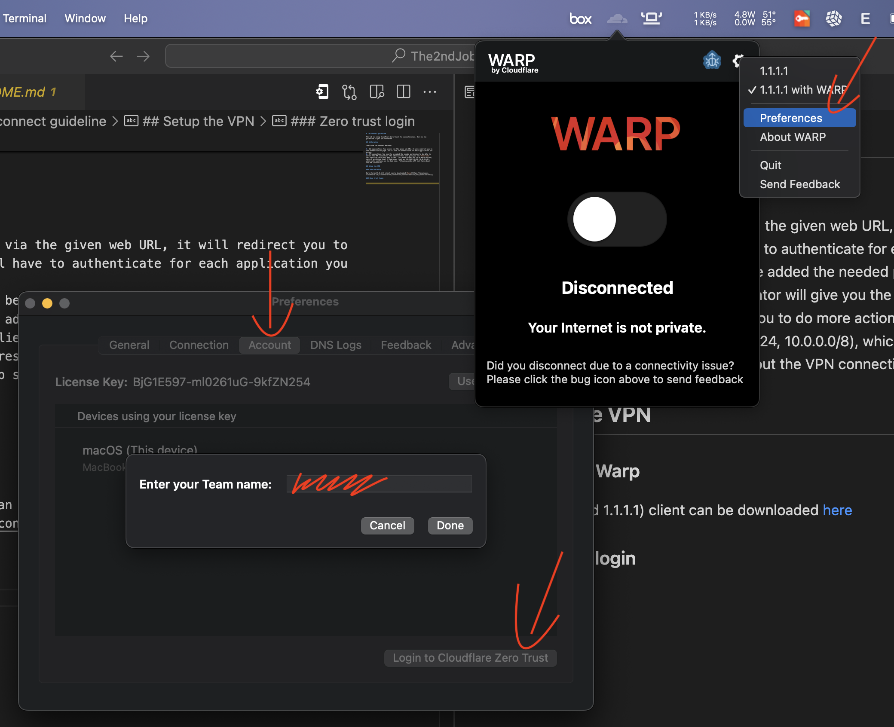
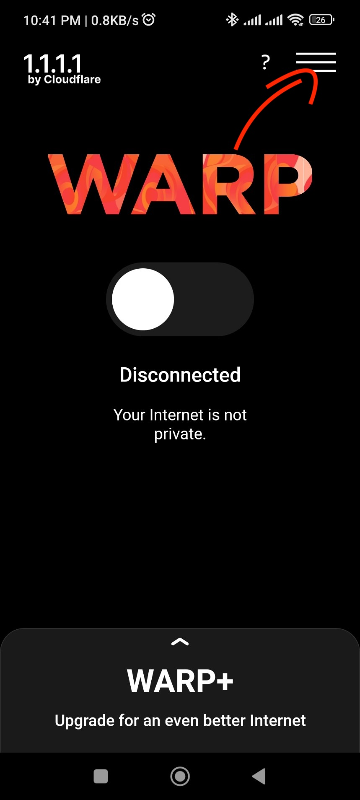
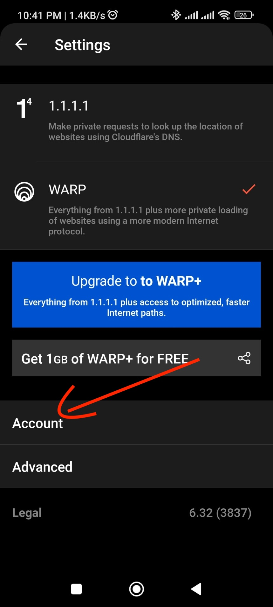
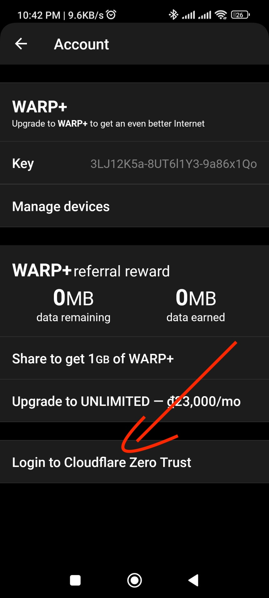
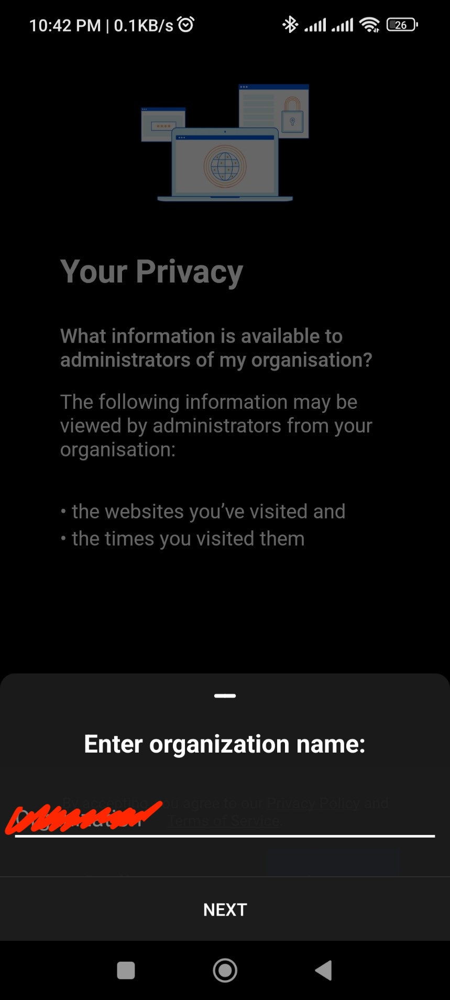

# Lab connect guideline

The lab is using CloudFlare Zero Trust for connectivities. Here is the guideline to get you connected

## Authorative

There are two connect methods:

1. Web application. You access via the given web URL, it will redirect you to the authentication page. You'll have to authenticate for each application you access.
2. VPN connection. You need to be added the needed permission to be able to enroll the VPN connection. The administrator will give you the `Team name` for inputting into your Warp client. This mode allows you to do more actions, such as accessing local IP addresses (such as 192.168.1.0/24, 10.0.0.0/8), which only available on the Lab side. Following guide will just talk about the VPN connection.

## Setup the VPN

### Download Warp

Warp (formed 1.1.1.1) client can be downloaded [here](https://developers.cloudflare.com/cloudflare-one/connections/connect-devices/warp/download-warp/)

### Zero trust login

On your Warp client (1.1.1.1), login to Zero Trust using the given Team name.

#### Mac

#### Android / iOS

#### Windows

`<TBU>`
